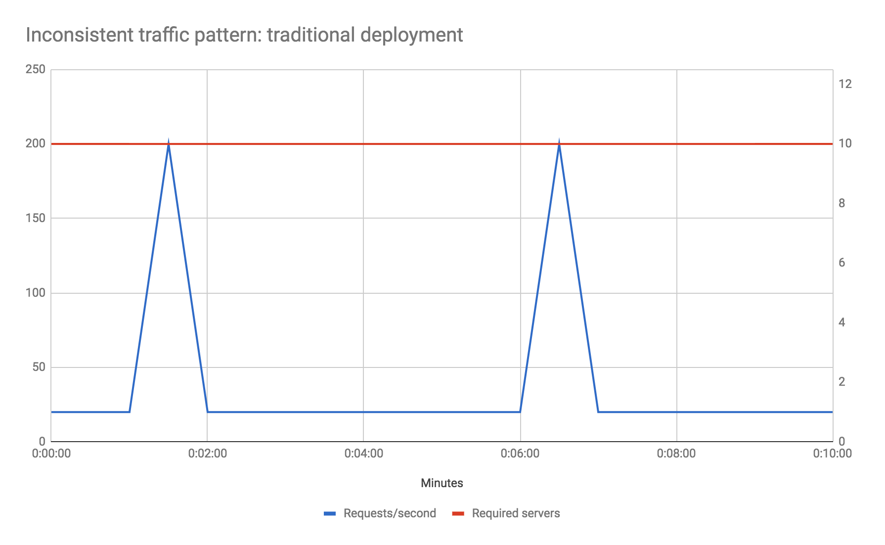

# 无服务器架构
>无服务器架构（Serverless architectures）是指一个应用大量依赖第三方服务（后端即服务，Backend as a Service，简称“BaaS”），或者把代码交由托管的、短生命周期的容器中执行（函数即服务，Function as a Service，简称“FaaS”）。现在最知名的 FaaS 平台是 AWS Lambda。把这些技术和单页应用等相关概念相结合，这样的架构无需维护传统应用中永远保持在线的系统组件。Serverless 架构的长处是显著减少运维成本、复杂度、以及项目起步时间，劣势则在于更加依赖平台供应商和现阶段仍有待成熟的支持环境。

## 引言
无服务器计算（Severless computing，简称 Serverless）现在是软件架构圈中的热门话题，三大云计算供应商（Amazon、Google 和 Microsoft）都在大力投入这个领域，涌现了不计其数的相关书籍、开源框架、商业产品、技术大会。到底什么是 Serverless？它有什么长处/短处？我希望通过本文对这些问题提供一些启发。

开篇我们先来看看 Serverless 是什么，之后我会尽我所能中立地谈谈它的优势和缺点。

## 什么是 Serverless
就像软件行业中的很多趋势一样，Serverless 的界限并不是特别清晰，尤其是它还涵盖了两个互相有重叠的概念：

* Serverless 最早用于描述那些大部分或者完全依赖于第三方（云端）应用或服务来管理服务器端逻辑和状态的应用，这些应用通常是富客户端应用（单页应用或者移动端 App），建立在云服务生态之上，包括数据库（Parse、Firebase）、账号系统（Auth0、AWS Cognito）等。这些服务最早被称为 “[(Mobile) Backend as a Service](https://en.wikipedia.org/wiki/Mobile_backend_as_a_service)”，下文将对此简称为 “BaaS”。

* Serverless 还可以指这种情况：应用的一部分服务端逻辑依然由开发者完成，但是和传统架构不同，它运行在一个无状态的计算容器中，由事件驱动、生命周期很短（甚至只有一次调用）、完全由第三方管理（感谢 ThoughtWorks 在他们最近的“[技术观察](https://www.thoughtworks.com/radar/techniques/serverless-architecture)”中对此所做的定义）。这种情况称为 [Functions as a service](https://twitter.com/marak/status/736357543598002176) / FaaS。[AWS Lambda](https://aws.amazon.com/lambda/) 是目前的热门 FaaS 实现之一，下文将对此简称为 “FaaS”。

【边栏注释：“Serverless” 术语的起源】
>Serverless 的起源

>术语“Serverless”令人困惑，因为这些应用程序在某处运行服务器硬件和服务器进程，但与普通方法相比的区别在于，构建和支持“Serverless”应用程序的组织并不关注那些硬件或那些进程，他们将这一责任外包给其他人。  

>这个术语的第一次使用似乎出现在 2012 年左右，在 Ken Fromm 撰写的[这篇文章](http://readwrite.com/2012/10/15/why-the-future-of-software-and-apps-is-serverless/)。 [Badri Janakiraman](https://twitter.com/badrij) 说他还听说过这个时期用于[持续集成](https://martinfowler.com/articles/continuousIntegration.html)和源控制系统作为服务托管的术语，而不是公司自己的服务器。然而，第二种使用是在关于开发团队基础设施（即软件团队使用的工具），而不是将外部服务整合到开发团队构建的实际产品中 - 我们现在倾向于使用无服务器的含义。  

>2015年 AWS Lambda 推出后，该术语在 2015 年变得更受欢迎，并且在亚马逊的 API Gateway 于2015年7月推出后，其受欢迎程度进一步提升。以下是 Ant Stanley 根据 API Gateway 公告撰写有关 Serverless 的文章。 2015 年 10 月亚马逊的 re:Invent 会议上发表了题为“[使用 AWS Lambda 的 Serverless 公司](https://www.youtube.com/watch?v=U8ODkSCJpJU)”的演讲，指的是 [PlayOn! Sports](http://www.playonsports.com/)。到 2015 年底，“Javascript 亚马逊网络服务（JAWS）”开源项目将自己重命名为 Serverless 框架，延续了这一趋势。  

>到 2016 年年中，Serverless 已经成为该领域的主要名称， [Serverless 会议](http://serverlessconf.io/)系列的诞生，以及各种 Serverless 供应商在从产品营销到职位描述的各个方面都采用了这个术语。Serverless 作为一个术语就这么诞生了。

本文将主要聚焦于 FaaS，不仅仅因为它是 Serverless 中最新也最热门的领域，更重要的是它和我们传统技术架构思路的显著不同。

BaaS 和 FaaS 在运维层面有类似之处（都无需管理硬件资源），并且也经常配合使用。主流的云服务商都会提供一套“Serverless 全家桶”，囊括了 BaaS 和 FaaS 产品——例如 Amazon 的 Serverless 产品介绍，Google 的 Firebase 服务也紧密集成了 Google Cloud Functions。

对小公司而言这两个领域也有交叉，[Auth0](https://auth0.com/) 最初是一个 BaaS 产品，提供用户管理的各种服务，他们后来创建了配套的 FaaS 服务 [Webtask](https://webtask.io/)，并且将此概念进一步延伸推出了 [Extend](https://auth0.com/extend/)，支持其他 BaaS 和 SaaS 公司能够轻松地在现有产品中加入 FaaS 能力。
###一些示例

#### 界面驱动的应用（UI-driven applications）

我们来设想一个传统的三层 C/S 架构，例如一个常见的电子商务应用（比如在线宠物商店），假设它服务端用 Java，客户端用 HTML/JavaScript：

在这个架构下客户端通常没什么功能，系统中的大部分逻辑——身份验证、页面导航、搜索、交易——都在服务端实现。

把它改造成 Serverless 架构的话会是这样：

这是张大幅简化的架构图，但还是有相当多变化之处：

1. 我们移除了最初应用中的身份验证逻辑，换用一个第三方的 BaaS 服务。

2. 另一个 BaaS 示例：我们允许客户端直接访问一部分数据库内容，这部分数据完全由第三方托管（如 AWS Dynamo），这里我们会用一些安全配置来管理客户端访问相应数据的权限。

3. 前面两点已经隐含了非常重要的第三点：先前服务器端的部分逻辑已经转移到了客户端，如保持用户 Session、理解应用的 UX 结构（做页面导航）、获取数据并渲染出用户界面等等。客户端实际上已经在逐步演变为[单页应用](https://en.wikipedia.org/wiki/Single-page_application)。

4. 还有一些任务需要保留在服务器上，比如繁重的计算任务或者需要访问大量数据的操作。这里以“搜索”为例，搜索功能可以从持续运行的服务端中拆分出来，以 FaaS 的方式实现，从 API 网关（后文做详细解释）接收请求返回响应。这个服务器端函数可以和客户端一样，从同一个数据库读取产品数据。 我们原始的服务器端是用 Java 写的，而 AWS Lambda（假定我们用的这家 FaaS 平台）也支持 Java，那么原先的搜索代码略作修改就能实现这个搜索函数。

5. 最后我们还可以把“购买”功能改写为另一个 FaaS 函数，出于安全考虑它需要在服务器端，而非客户端实现。它同样经由 API 网关暴露给外部使用。

#### 消息驱动的应用（Message-driven applications）
再举一个后端数据处理服务的例子。假设你在做一个需要快速响应 UI 的用户中心应用，同时你又想捕捉记录所有的用户行为。设想一个在线广告系统，当用户点击了广告你需要立刻跳转到广告目标，同时你还需要记录这次点击以便向广告客户收费（这个例子并非虚构，我的一位前同事最近就在做这项重构）。

传统的架构会是这样：“广告服务器”同步响应用户的点击，同时发送一条消息给“点击处理应用”，异步地更新数据库（例如从客户的账户里扣款）。

在 Serverless 架构下会是这样：

这里两个架构的差异比我们上一个例子要小很多。我们把一个长期保持在内存中待命的任务替换为托管在第三方平台上以事件驱动的 FaaS 函数。注意这个第三方平台提供了消息代理和 FaaS 执行环境，这两个紧密相关的系统。

### 解构 “Function as a Service”
我们已经提到多次 FaaS 的概念，现在来挖掘下它究竟是什么含义。先来看看 Amazon 的 [Lambda 产品简介](https://aws.amazon.com/cn/lambda/)：

>通过 AWS Lambda，无需配置或管理服务器(1)即可运行代码。您只需按消耗的计算时间付费 – 代码未运行时不产生费用。借助 Lambda，您几乎可以为任何类型的应用程序或后端服务(2)运行代码，而且全部无需管理。只需上传您的代码，Lambda 会处理运行(3)和扩展高可用性(4)代码所需的一切工作。您可以将您的代码设置为自动从其他 AWS 服务(5)触发，或者直接从任何 Web 或移动应用程序(6)调用。

1. 本质上 FaaS 就是无需配置或管理你自己的服务器系统或者服务器应用即可运行后端代码，其中第二项——服务器应用——是个关键因素，使其区别于现今其他一些流行的架构趋势如容器或者 PaaS（Platform as a Service）。 回顾前面点击处理的例子，FaaS 替换掉了点击处理服务器（可能跑在一台物理服务器或者容器中，但绝对是一个独立的应用程序），它不需要服务器，也没有一个应用程序在持续运行。

2. FaaS 不需要代码基于特定的库或框架，从语言或环境的层面来看 FaaS 就是一个普通的应用程序。例如 AWS Lambda 支持 JavaScript、Python 以及任意 JVM 语言（Java、Clojure、Scala 等），并且你的 FaaS 函数还可以调用任何一起部署的程序，也就是说实际上你可以用任何能编译为 Unix 程序的语言（稍后我们会讲到 Apex）。FaaS 也有一些不容忽视的局限，尤其是牵涉到状态和执行时长问题，这些我们稍后详谈。 再次回顾一下点击处理的例子——代码迁移到 FaaS 唯一需要修改的是 main 方法（启动）的部分，删掉即可，也许还会有一些上层消息处理的代码（实现消息监听界面），不过这很可能只是方法签名上的小改动。所有其他代码（比如那些访问数据库的）都可以原样用在 FaaS 中。

3. 既然我们没有服务器应用要执行，部署过程也和传统的方式大相径庭——把代码上传到 FaaS 平台，平台搞定所有其他事情。具体而言我们要做的就是上传新版的代码（zip 文件或者 jar 包）然后调用一个 API 来激活更新。

4. 横向扩展是完全自动化、弹性十足、由 FaaS 平台供应商管理的。如果你需要并行处理 100 个请求，不用做任何处理系统可以自然而然地支持。FaaS 的“运算容器”会在运行时按需启动执行函数，飞快地完成并结束。 回到我们的点击处理应用，假设某个好日子我们的客户点击广告的数量有平日的十倍之多，我们的点击处理应用能承载得住么？我们写的代码是否支持并行处理？支持的话，一个运行实例能够处理这么多点击量吗？如果环境允许多进程执行我们能自动支持或者手动配置支持吗？以 FaaS 实现你的代码需要一开始就以并行执行为默认前提，但除此之外就没有其他要求了，平台会完成所有的伸缩性需求。

5. FaaS 中的函数通常都由平台指定的一些事件触发。在 AWS 上有 S3（文件）更新、时间（定时任务）、消息总线（[Kinesis](https://aws.amazon.com/kinesis/)）消息等，你的函数需要指定监听某个事件源。在点击处理器的例子中我们有个假设是已经采用了支持 FaaS 订阅的消息代理，如果没有的话这部分也需要一些代码量。

6. 大部分的 FaaS 平台都支持 HTTP 请求触发函数执行，通常都是以某种 API 网关的形式实现（如 [AWS API Gateway](https://aws.amazon.com/api-gateway/)，[Webtask](https://webtask.io/)）。我们在宠物商店的例子中就以此来实现搜索和购买功能。

### 状态
当牵涉到本地（机器或者运行实例）状态时 FaaS 有个不能忽视的限制。简单点说就是你需要接受这么一个预设：函数调用中创建的所有中间状态或环境状态都不会影响之后的任何一次调用。这里的状态包括了内存数据和本地磁盘存储数据。从部署的角度换句话说就是 FaaS 函数都是无状态的（Stateless）。

这对于应用架构有重大的影响，无独有偶，“Twelve-Factor App” 的概念也有[一模一样的要求](http://12factor.net/processes)。

在此限制下的做法有多种，通常这个 FaaS 函数要么是天然无状态的——纯函数式地处理输入并且输出，要么使用数据库、跨应用缓存（如 Redis）或者网络文件系统（如 S3）来保存需要进一步处理的数据。

### 执行时长
FaaS 函数可以执行的时间通常都是受限的，目前 AWS Lambda 函数执行最长不能超过五分钟，否则会被强行终止。

这意味着某些需要长时间执行的任务需要调整实现方法才能用于 FaaS 平台，例如你可能需要把一个原先长时间执行的任务拆分成多个协作的 FaaS 函数来执行。

### 启动延迟
目前你的 FaaS 函数响应请求的时间会受到大量因素的影响，可能从 10 毫秒到 2 分钟不等。这听起来很糟糕，不过我们来看看具体的情况，以 AWS Lambda 为例。

如果你的函数是 JavaScript 或者 Python 的，并且代码量不是很大（千行以内），执行的消耗通常在 10 到 100 毫秒以内，大函数可能偶尔会稍高一些。

如果你的函数实现在 JVM 上，会偶尔碰到 10 秒以上的 JVM 启动时间，不过这只会在两种情况下发生：

* 你的函数调用触发比较稀少，两次调用间隔超过 10 分钟。
* 流量突发峰值，比如通常每秒处理 10 个请求的任务在 10 秒内飙升到每秒 100 个。

前一种情况可以用个 hack 来解决：每五分钟 ping 一次给函数保持热身。

这些问题严重么？这要看你的应用类型和流量特征。我先前的团队有一个 Java 的异步消息处理 Lambda 应用每天处理数亿条消息，他们就完全不担心启动延迟的问题。如果你要写的是一个低延时的交易程序，目前而言肯定不会考虑 FaaS 架构，无论你是用什么语言。

不论你是否认为你的应用会受此影响，都应该以生产环境级别的负载测试下实际性能情况。如果目前的情况还不能接受的话，可以几个月后再看看，因为这也是现在的 FaaS 平台供应商们主要集中精力在解决的问题。

### API 网关

我们前面还碰到过一个 FaaS 的概念：“API 网关”。API 网关是一个配置了路由的 HTTP 服务器，每个路由对应一个 FaaS 函数，当 API 网关收到请求时它找到匹配请求的路由，调用相应的 FaaS 函数。通常 API 网关还会把请求参数转换成 FaaS 函数的调用参数。最后 API 网关把 FaaS 函数执行的结果返回给请求来源。

AWS 有自己的一套 API 网关，其他平台也大同小异。

除了纯粹的路由请求，API 网关还会负责身份认证、输入参数校验、响应代码映射等，你可能已经敏锐地意识到这是否合理，如果你有这个考虑的话，我们待会儿就谈。

另一个应用 API 网关加 FaaS 的场景是创建无服务器的 http 前端微服务，同时又具备了 FaaS 函数的伸缩性、管理便利等优势。

目前 API 网关的相关工具链还不成熟，尽管这是可行的但也要够大胆才能用。
### 工具链
前面关于工具链还不成熟的说法是指大体上 FaaS 无服务器架构平台的情况，也有例外，[Auth0 Webtask](https://webtask.io/) 就很重视改善开发者体验，[Tomasz Janczuk](https://twitter.com/tjanczuk) 在最近一届的 Serverless Conf 上做了精彩的展示。

无服务器应用的监控和调试还是有点棘手，我们会在本文未来的更新中进一步探讨这方面。
### 开源
无服务器 FaaS 的一个主要好处就是只需要近乎透明的运行时启动调度，所以这个领域不像 Docker 或者容器领域那么依赖开源实现。未来肯定会有一些流行的 FaaS / API 网关平台实现可以跑在私有服务器或者开发者工作站上，IBM 的 [OpenWhisk](https://openwhisk.apache.org/) 就是一个这样的实现，不知道它是否能成为流行选择，接下来的时间里肯定会有更多竞争者出现。

除了运行时的平台实现，还是有不少开源工具用以辅助开发和部署的，例如 [Serverless Framework](https://github.com/serverless/serverless) 在 API 网关 + Lambda 的易用性上就比它的原创者 AWS 要好很多，这是一个 JS 为主的项目，如果你在写一个 JS 网关应用一定要去了解下。

再如 [Apex](https://github.com/apex/apex)——“轻松创建、部署及管理 AWS Lambda 函数”。Apex 有意思的一点是它允许你用 AWS 平台并不直接支持的语言来实现 Lambda 函数，比如 Go。

## 什么不是 Serverless
在前文中我定义了 “Serverless” 是两个概念的组合：“Backend as a Service” 和 “Function as a Service”，并且对后者的特性做了详细解释。

在我们开始探讨它的好处和弊端之前，我想再花点儿时间在它的定义上，或者说：区分开那些容易和 Serverless 混淆的概念。我看到一些人（包括我自己最近）对此都有困惑，我想值得对此做个澄清。

### 对比 PaaS
既然 Serverless FaaS 这么像 12-Factor 应用，那不就是另一种形式的 Platform as a Service 么？就像 Heroku？对此借用 Adrian Cockcroft 一句非常简明的话：

>如果你的 PaaS 能在 20ms 内启动一个只运行半秒钟的实例，它就叫 Serverless。 — [Adrian Cockcroft](https://twitter.com/adrianco/status/736553530689998848)

换句话说，大部分 PaaS 应用不会为了每个请求都启动并结束整个应用，而 FaaS 就是这么做的。

好吧，然而假设我是个娴熟的 12-Factor 应用开发者，写代码的方式还是没有区别对么？没错，但是你如何运维是有很大不同的。鉴于我们都是 DevOps 工程师我们会在开发阶段就充分考虑运维，对吧？

FaaS 和 PaaS 在运维方面的关键区别是伸缩性（Scaling）。对于大多数 PaaS 平台而言你需要考虑如何伸缩，例如在 Heroku 上你要用到多少 Dyno 实例？对于 FaaS 应用这一步骤是完全透明的。即便你将 PaaS 配置为自动伸缩，也无法精细到单个请求级别，除非你有一个非常明确稳定的流量曲线可以针对性地配置。所以 FaaS 应用在成本方面要高效得多。

既然如此，何必还用 PaaS？有很多原因，最主要的因素应该是工具链成熟度。另外像 [Cloud Foundry](https://en.wikipedia.org/wiki/Cloud_Foundry) 能够给混合云和私有云的开发提供一致体验，在写就本文的时候 FaaS 还没有这么成熟的平台。

### 对比容器
使用 Serverless FaaS 的好处之一是避免在操作系统层面管理应用程序进程。有一些 PaaS 平台如 Heroku 也提供了这样的特性；另一种对进程的抽象是容器，这类技术的代表是 [Docker](https://www.docker.com/)。容器托管系统（Mesos、Kubernetes 等）把应用从系统级开发中抽象出来，这种做法日渐流行，甚至在此之上云服务商的容器平台（如 [Amazon ECS](https://aws.amazon.com/ecs/)、[EKS](https://aws.amazon.com/eks/)、[Google Cloud Engine](https://cloud.google.com/container-engine)）也像 Serverless FaaS 一样允许团队从管理主机中完全解放出来。在这股容器大潮中，FaaS 是否还有优势？

概念上来说前面对 PaaS 的论断仍旧适用于容器。Serverless FaaS 的伸缩性是完全自动化、透明、良好组织的，并且自动进行资源监控和分配；而容器平台仍旧需要你对容量和集群进行管理。

另外我还得说容器技术也处在不够成熟和稳定的阶段，尽管它越来越接近了。当然这不是说 Serverless 就成熟了，但你终究需要在两个都属前沿的技术方向中做出选择。

还有个值得一提的是不少容器平台支持了自动伸缩的容器集群，Kubernetes 有内建的 [Horizontal Pod Autoscaling](http://kubernetes.io/docs/user-guide/horizontal-pod-autoscaling/) 功能，[AWS Fargate](https://aws.amazon.com/fargate/) 则承诺会有“Serverless 容器”。

总的来说 Serverless FaaS 和托管容器在管理和伸缩性方面的差别已经不大，在它们之间的取舍更多看风格取向和应用的类型。例如事件驱动的应用组件更适合用 FaaS 实现，而同步请求驱动的应用组件更适合用容器实现。我预计很快就会有不少团队和应用同时采用这两种架构模式，期待看它们会擦出怎样的火花。

### 对比 NoOps
Serverless 并非“零运维”——尽管它可能是“无系统管理员”，也要看你在这个 Serverless 的兔子洞里走多深。

“运维”的意义远不止系统管理，它还包括并不限于监控、部署、安全、网络、支持、生产环境调试以及系统伸缩。这些事务同样存在于 Serverless 应用中，你仍旧需要相应的方法处理它们。某些情况下 Serverless 的运维会更难一些，毕竟它还是个崭新的技术。

系统管理的工作仍然要做，你只是把它外包给了 Serverless 环境。这既不能说坏也不能说好——我们外包了大量的内容，是好是坏要看具体情况。不论怎样，某些时候这层抽象也会发生问题，就会需要一个来自某个地方的人类系统管理员来支持你的工作了。

[Charity Majors](https://twitter.com/mipsytipsy) 在第一届 Serverless 大会上就这个主题做了个[非常不错的演讲](https://www.youtube.com/watch?v=wgT5f0eBhD8)，也可以看看她相关的两篇文章：[WTF is operations?](https://charity.wtf/2016/05/31/wtf-is-operations-serverless/) 和 [Operational Best Practices](https://charity.wtf/2016/05/31/operational-best-practices-serverless/)）。

### 对比存储过程即服务
还有一种说法把 Serverless FaaS 看做“存储过程即服务（Stored Procedures as a Service）”，我想原因是很多 FaaS 函数示范都用数据库访问作为例子。如果这就是它的主要用途，我想这个名字也不坏，但终究这只是 FaaS 的一种用例而已，这样去考虑 FaaS 局限了它的能力。

>我好奇 Serverless 会不会最终变成类似存储过程那样的东西，开始是个好主意，然后迅速演变成大规模技术债务。 — [Camille Fournier](https://twitter.com/skamille/status/719583067275403265)

但我们仍然值得考虑 FaaS 是否会导致跟存储过程类似的问题，包括 Camille 提到的技术债。有很多存储过程给我们的教训可以放在 FaaS 场景下重新审视，存储过程的问题在于：

1. 通常依赖于服务商指定的语言，或者至少是指定的语言框架/扩展

2. 因为必须在数据库环境中执行所以很难测试

3. 难以进行版本控制，或者作为应用包进行管理

尽管不是所有存储过程的实现都有这些问题，但它们都是常会碰到的。我们看看是否适用于 FaaS：

第一条，就目前看来显然不是 FaaS 的烦恼，直接排除。

第二条，因为 FaaS 函数都是纯粹的代码，所以应该和其他任何代码一样容易测试。整合测试是另一个问题，我们稍后展开细说。

第三条，既然 FaaS 函数都是纯粹的代码，版本控制自然不成问题；最近大家开始关心的应用打包，相关工具链也在日趋成熟，比如 Amazon 的 [Serverless Application Model](https://docs.aws.amazon.com/lambda/latest/dg/serverless_app.html)（SAM）和前面提到的其他 Serverless 框架都提供了类似的功能。2018 年初 Amazon 还开放了 [Serverless Application Repository](https://aws.amazon.com/cn/serverless/serverlessrepo/)（SAR）服务，方便组织分发应用程序和组件，也是基于 AWS Serverless 服务构建的。关于 SAR 可以看看我的另一篇文章：[Examining the AWS Serverless Application Repository](https://blog.symphonia.io/examining-the-aws-serverless-application-repository-9ef316e2fd4)。

## 优点
到目前为止，我们一直试图只定义和解释 Serverless 架构的含义。现在我将讨论这种设计和部署应用程序方法的一些优点和缺点。你绝对不应该在没有充分考虑并权衡利弊的情况下使用 Serverless 。让我们从彩虹和独角兽的国度开始，看看 Serverless 的好处。

### 减少运营成本

在最简单的情况下，Serverless 是一个外包解决方案。它允许你花钱请人来管理服务器、数据库，甚至你自己管理的应用程序逻辑。由于你使用了许多其他人也将使用的预定义服务，因此我们看到了[规模效应的经济性](https://en.wikipedia.org/wiki/Economies_of_scale)。因为一个供应商正在运行数千个非常类似的数据库，所以你为托管数据库支付的费用较低。降低的成本给你带来的收益来自两个方面：

第一个是基础设施成本收益，它纯粹来自于与他人共享基础设施(如硬件、网络)；

第二个是人工成本收益，你可以花更少的时间在外包的 Serverless 系统上，而不是花在自己开发和托管的同等系统上。但是，这种好处与你从基础设施服务（IaaS）或平台服务（PaaS）中获得的好处并没有太大的不同。但是可以通过 Serverless 的 BaaS 和 FaaS 来扩展这一优势。

### BaaS：减少开发成本

IaaS 和 PaaS 的前提是服务器和操作系统管理能够商品化，而 Serverless BaaS 则是整个应用程序组件商品化的结果。

身份验证就是一个很好的例子。许多应用程序编写自己的身份验证功能，这些功能通常包括注册、登录、密码管理和与其他身份验证提供者的集成等。总的来说，这种逻辑在大多数应用程序中都非常相似，像 [Auth0](https://auth0.com/) 这样的服务已经被创建，它允许我们将已经构建好的身份验证功能集成到应用程序中，而无需我们自己开发它。

BaaS 数据库也是同样道理，比如 [Firebase](https://firebase.google.com/docs/database/) 的数据库服务。一些移动应用程序团队发现，让客户端直接与服务器端数据库通信是有意义的。BaaS 数据库删除了大量的数据库管理开销，并且提供了对不同类型的用户执行适当授权的机制，这与 Serverless 应用程序的模式相同。

根据你的实际情况，这些想法可能会让你感到不安(我们将在缺陷一节中讨论)，但不可否认的是，许多成功的公司几乎不用自己的服务端代码就能生产出令人信服的产品。Joe Emison 在第一届无服务器会议上举了[几个例子](http://www.slideshare.net/ServerlessConf/joe-emison-10x-product-development)。

###FaaS：扩容成本

Serverless FaaS 的乐趣之一是 —— 正如我在本文前面提到的 —— “水平缩放是完全自动的、有弹性的，并且由服务商管理”。它有很多好处，但最大的好处是，你只需要为你使用的的计算付钱。如在 AWS Lambda 中，取决于应用形态，可能只需要支付 100 毫秒的边界，对你而言这很划算。

####例一：偶尔的请求

假设你正在运行一个服务器应用程序，该应用程序每分钟只处理一个请求，处理每个请求需要 50 毫秒，则你在一个小时内的平均 CPU 使用率是 0.1%。如果这个应用程序部署到自己的专用主机上，那么这是非常低效的。其实上千个类似的应用程序都可以共享一台机器。

Serverless FaaS 解决了这种低效率，以更低的成本为你提供好处。在上面的示例应用程序中，你只需要为每分钟所花费的 100 毫秒计算时间付钱，这是总时间的 0.15%。这带来了下面的连锁效应：

对于需要很小负载的潜在微服务，它支持按逻辑/域分解组件。

这样的成本效益非常赞。如果公司或团队想要尝试一些新的东西，当使用 FaaS 来满足他们的计算需求时，运营成本就非常小。事实上，如果你的总工作负载相对较小（但并非完全不重要），你可能根本不需要为任何计算付费，因为一些 FaaS 供应商提供了“免费层”。

####例二：不一致的流量

让我们看另一个例子。假设你的流量配置文件非常繁忙——可能你的基本流量是每秒 20 个请求，但是每 5 分钟你就会在 10 秒钟内接收到每秒 200 个请求（是通常数量的10倍）。如果你不想希望在流量峰值阶段减少响应时间，怎么解决这个问题？

在传统环境中，你可能需要将硬件总数增加 10 倍，以处理峰值，即使峰值的总持续时间占总机器正常运行时间的不到 4%。在这里，自动缩放可能不是一个好的选择，因为在新实例启动时，服务器的新实例需要较长的启动时间。

然而对于 Serverless FaaS，这就不是一个问题。你并不需要做什么，你仅需要支付高峰期产生的额外计算能力。

显然，我在这里特意选择了几个例子，其中 Serverless FaaS 可以节省大量的成本。但重点是想说明，从缩放的角度来看，除非你有一个非常稳定的流量形态，并且始终充分利用你的服务器主机的全部能力，否则使用 FaaS 可以节省成本。

关于上述内容的一个警告：如果你的流量是统一的并且能够始终如一地利用正在运行的服务器，你可能看不到这种成本收益，并且你实际上可能通过使用 FaaS 花费更多。你应该进行一些数学运算，并将当前的提供商成本与运行全时服务器的等价物进行比较，以确定成本是否可接受。  

有关 FaaS 成本效益的更多详细信息，我推荐 Gojko Adzic 和 Robert Chatley 撰写的“[Serverless Computing: Economic and Architectural Impact](http://www.doc.ic.ac.uk/~rbc/papers/fse-serverless-17.pdf)”一文。

####优化是节约成本的根源

关于 FaaS 成本还有一个更有趣的方面：对代码进行性能优化不仅会提高应用程序的速度，而且还会直接降低运营成本，具体降低多少取决于供应商的收费的粒度。例如，假设一个应用程序最初需要一秒钟来处理一个事件。如果通过代码优化，这将减少到 200ms，它（在 AWS Lambda 上）将立即看到在不更改任何基础设施的情况下，计算成本节省了 80%。
### 简单的运营管理
在 Serverless BaaS 方面，很容易理解为什么运维管理比其他体系结构更简单：支持更少的组件就等于更少的工作。

在 Serverless FaaS 方面，有许多方面在起作用，我将深入研究其中的几个方面。

####将 FaaS 的好处扩展到基础设施成本之外

尽管上一节中我们对缩放记忆犹新，但值得注意的是，FaaS 的缩放功能不仅降低了计算成本，还减少了操作管理，因为缩放是自动的。

最好的例子是如果你的缩放过程是手动的（例如，需要人为地向服务器数组添加和删除实例），那么使用 FaaS 你可以很高兴地忽略这一点，并让 FaaS 供应商为你扩展应用程序。

即使你在非 FaaS 体系结构中已经达到自动缩放的程度，但仍然需要安装和维护，而 FaaS 不再需要这项工作。

类似地，由于提供方是在每个请求/事件上进行扩缩容，因此你不再需要考虑在内存不足或看到太多性能损失时可以处理多少并发请求的问题 。不过考虑到其负载可能显著增加，必须重新考虑下游数据库和非 FaaS 组件。

#### 减少打包和部署的复杂性

与部署整个服务应用相比，打包和部署 FaaS 功能很简单。你所做的就是将所有代码打包成一个 zip 文件，然后上载它。没有 Puppet/Chef，没有启动/停止 shell 脚本，不需要决定是否在机器上部署一个或多个容器。如果你刚刚起步，那么你甚至不需要打包任何东西——甚至可以在服务提供者的控制台上编写代码（显然，这并不推荐!）。

这个过程不需要很长时间来描述，但是对于一些团队来说，这个好处可能是绝对巨大的：一个完全 Serverlesss 的解决方案不需要系统管理。

PaaS 解决方案具有类似的部署优势，但正如我们前面看到的，在比较 PaaS 和 FaaS 时，FaaS 在伸缩性方面具有优势。

#### 是时候进行市场营销和持续试验了

更简单的运维管理是我们工程师所理解的好处，但这对我们的业务意味着什么呢?

显而易见的是成本：花费在运维上的时间越少，运维所需的人员就越少，正如已经描述的那样。但在我看来，更重要的是[上线时间](https://en.wikipedia.org/wiki/Time_to_market)。随着我们的团队和产品越来越倾向于精益和敏捷流程，我们希望不断尝试新事物并快速更新现有系统。虽然在持续交付的环境中进行简单的重新部署可以快速迭代稳定的项目，但是拥有“快速部署”的能力允许我们尝试平滑和低成本的新实验。

FaaS 的快速部署特性通常非常出色，特别是对于由供应商生态系统中的成熟定义事件触发的简单功能。例如，假设您的组织已经在使用 AWS Kinesis（一种类似 Kafka 的消息传递系统），通过你的基础架构广播各种类型的实时事件。使用 AWS Lambda，你可以在几分钟内针对该 Kinesis 流开发和部署新的生产事件监听器 - 您可以在一天内尝试几个不同的实验！

虽然成本效益是 Serverless 最容易显现的改进，但上线时间的提前让我最兴奋。它可以使产品开发的思维模式持续不断地试验，这才是对软件交付的真正革命。

### “绿色”计算？
在过去的几十年里，世界上数据中心的数量和规模都有了巨大的增长。使用物理资源来构建这些中心，相关的能源需求是如此之大，这会造成巨大的环境影响。以至于苹果，谷歌等都在谈论将一些数据中心托管在可再生能源附近以减少化石燃料燃烧的影响这些网站本来是必要的。  

空闲，但通电后，服务器消耗了大量的能量 - 而且它们是我们需要这么多，更大的数据中心的重要原因之一：

>商业和企业数据中心中的典型服务器在一年中平均提供其最大计算输出的5％到15％。

>[-- Forbes](http://www.forbes.com/sites/benkepes/2015/06/03/30-of-servers-are-sitting-comatose-according-to-research/#2f4944612c2)

这非常低效，并产生巨大的环境影响。

一方面，云基础设施可能已经帮助减少了这种影响，因为公司只能在绝对需要的时候“购买”更多的服务器，而不是提前很长时间提供所有可能需要的服务器。不过，也有人可能会说，如果很多服务器没有进行足够的容量管理，那么供应服务器的便捷性可能会让情况变得更糟。

无论我们使用的是自托管服务器、IaaS、还是 PaaS 基础架构解决方案，我们仍然需要手工决策应用程序的容量，这些决策通常要持续数月或数年。通常，我们对管理能力持谨慎态度，这是正确的，但这导致过度供应，导致低效。使用 Serverless 的方法，不再自己计算容量——让 Serverless 供应商提供的计算能力刚好满足实时需求。供应商可以综合他的客户的共同需求做出容量计算。

这种差异将提升跨数据中心的资源使用效率，因此与传统的容量管理方法相比，可以减少环境影响。

## 缺陷
所以，亲爱的读者，我希望你在彩虹和独角兽以及所有闪亮而美好的事物中享受你的时光，因为我们即将被现实中的打脸。  对于 Serverless 架构肯定有很多优势，但它们有很大的权衡取舍。其中一些权衡是概念锁固有的；它们不能完全由进步来决定，而且它们总是需要被考虑。其他则与当前的实施相关联；随着时间的推移，我们可以期待看到这些解决。

### 固有缺陷
#### 供应商限制
对于任何外包策略，都是将一些系统控制权交给第三方供应商。这种缺乏控制可能表现为系统停机、意外限制、成本更改、功能丢失、强制API升级等等。

我之前提到的 Charity Majors 在本文的权衡部分更详细地解释了这个问题：

> [供应商服务]，如果它是智能的，将对你如何使用它施加强大的限制，因此他们更有可能实现其可靠性目标。当用户具有灵活性和选项时，会产生混乱和不可靠性。如果平台必须在你的幸福与成千上万的其他客户的幸福之间做出选择，那么他们每次都会选择更多人 - 就像他们应该的那样。

>-- [Charity Majors](https://charity.wtf/2016/05/31/operational-best-practices-serverless/)

#### 多租户问题

[多租户](https://en.wikipedia.org/wiki/Multitenancy)指多个不同客户(或租户)的软件实例在同一台机器上运行，且可能在同一托管应用程序中运行的情况，这是实现规模经济效益的策略。服务供应商尽其所能让客户觉得他们是唯一使用他们系统的人，而通常优秀的服务供应商在这方面做得很好。但是，没有一个完美的多租户解决方案，有时会在安全性（一个客户能够看到另一个客户的数据）、健壮性（一个客户的软件中的错误导致另一个客户的软件出现故障）和性能（一个高负载的客户导致另一个客户的速度变慢）方面存在问题。这些问题并非 Serverless 系统独有——它们存在于使用多租户的许多其他服务产品中。AWS Lambda现在已经足够成熟，我们不希望看到它出现此类问题，但是我们应该注意任何不太成熟服务（无论是来自 AWS 还是其他供应商）的此类问题。

#### 供应商绑定

你从一个供应商拿到的任何 Serverless 特性都很可能由另一个供应商以不同方式实现。如果你想换供应商几乎肯定需要更新你的操作工具（部署、监控、等等），可能需要改变代码（例如，以满足不同的 FaaS 接口），甚至可能需要改变设计或架构。

即使能够轻松地迁移生态系统的一部分，你还可能会受到另一个体系结构组件的更大影响。假设你正在使用 AWS Lambda 来响应 AWS Kinesis 消息总线上的事件，尽管 [AWS Lambda](https://aws.amazon.com/lambda/), [Google Cloud Functions](https://cloud.google.com/functions/docs/) 和 [Microsoft Azure Functions](https://azure.microsoft.com/en-us/services/functions/) 之间的差异可能相对较小，但仍然无法将后两个供应商实现直接连接 AWS 的 Kinesis 流。这意味着，如果不迁移基础设施的其它部分，就不可能将代码从一个解决方案迁移到另一个解决方案。

很多人都被这个想法吓到了——如果今天选择的云供应商明天需要更改，还需要做很多工作，那么的确体验很差。因此，一些人采用“多云”方法，开发和操作应用程序的方式与实际使用的云供应商无关，但这通常比单云方法成本更高——因此，虽然供应商绑定是一个问题，但我仍然建议选择一个你满意的供应商，并尽可能地利用它们的功能。

#### 安全考虑

采用 Serverless 方法会面临大量安全问题。这里有一些需要考虑的事情：

* 你所使用的每个 Serverless 供应商都会增加你系统中的不同安全方案，这会增加您的表面区域以防止恶意，并增加攻击成功的可能性。

* 如果直接从移动平台使用 BaaS 数据库，将失去服务端应用程序在传统应用程序中提供的保护屏障。虽然这并不是什么大问题，但在设计和开发应用程序时仍需要特别小心。

* 当你的组织接受 FaaS 时，可能会经历整个公司 FaaS Functions 的爆发。例如，在 AWS Lambda 中，每个 Lambda 函数通常都附带一个配置好的 [IAM](https://docs.aws.amazon.com/lambda/latest/dg/access-control-identity-based.html) 策略，这很容易出错。这不是一个简单的话题，也不是一个可以忽略的话题。IAM管理需要仔细考虑，至少在生产环境的AWS帐户中是这样。

#### 跨客户平台的逻辑重复

使用“完整的” BaaS 体系结构，服务端不编写自定义逻辑——全部在客户机中编写。这对于你的第一个客户端平台来说可能还好，但是一旦你需要换一个平台，你就需要重复实现该逻辑的一个子集，但在更传统的体系结构中你不需要这样的重复工作。例如，如果在这种系统中使用BaaS数据库，那么你的所有客户机应用程序（可能是web、原生iOS和原生Android）现在都需要能够与供应商数据库通信，并且需要了解如何从数据库模式映射到应用程序逻辑。

此外，如果您想在任何时候迁移到新数据库，您将需要在所有不同的客户端上重复编码/协调更改。

#### 服务器优化丢失

有了完整的 BaaS 体系结构，就没有机会为优化服务端程序设计了。“[后端到前端](http://samnewman.io/patterns/architectural/bff/)”模式的存在是为了在服务器中抽象出整个系统的某些底层知识，在某种程度上是为了让客户端在移动应用程序中能够更快地执行操作，并使用更少的电池电量。这种模式不适用于完整的 BaaS。

对于完整的 BaaS 体系结构，存在另一缺点：在这种体系结构中，所有定制逻辑都位于客户机中，并且只提供供应商提供的后端服务。缓解这两种情况的一种方法是采用 FaaS 或其他类型的轻量级服务端模式，并将某些逻辑转移到服务器。

#### 服务器状态缺失
在经历了几个特定于 BaaS 的缺点之后，我们暂时谈谈 FaaS。我刚才说过：  

>当涉及到本地状态时，FaaS 功能有很大的限制。 您不应该假设一次函数调用的状态可用于同一函数的另一次调用。

这种假设的原因是：对于FaaS，我们通常无法控制函数的主机容器何时启动和停止。

我之前也说过，本地状态的替代方案是遵循 Twelve-Factor App 的第 6个因素，即接受这个非常约束：

>Twelve-Factor 流程是无状态的，无共享。任何需要持久存储的数据都必须存储在有状态的后备服务中，通常是数据库。  

>-- Twelve-Factor App  

Heroku 推荐这种思维方式，但是你可以在运行他们的 PaaS 时弯曲规则，因为你可以控制 Heroku Dynos 的启动和停止时间。使用 FaaS 并没有违反规则。

那么，如果不能将状态保存在内存中，FaaS 的状态会如何变化呢？在许多情况下，使用快速 NoSQL 数据库、进程外缓存（例如 Redis）或外部对象/文件存储（例如S3）是一些选项。但是这些都比内存或机器上的持久化慢得多。你需要考虑应用程序是否适合这种情况。

这方面的另一个问题是内存缓存。许多从外部存储的大数据集读取数据的应用程序会在内存中保留部分数据集的缓存。你可能正在从数据库中的“引用数据”表读取数据，并使用 [Ehcache](http://www.ehcache.org/) 之类的东西。或者，也可以从指定缓存头的 HTTP 服务中读取，在这种情况下，内存中的 HTTP 客户机可以提供本地缓存。FaaS 确实允许使用一些本地缓存，如果你的函数使用得足够频繁，这可能是有用的。例如，对于 AWS Lambda，我们通常希望一个函数实例能够存在几个小时，每隔几分钟至少使用一次。这意味着可以使用Lambda 提供的（可配置的)）3gb RAM，或 512mb 本地“/tmp”空间，对于某些缓存，可能足够了。否则，不考虑进程内缓存，使用 Redis 或 Memcached 之类的低延迟外部缓存。然而，这需要额外的工作，可能会非常慢。

### 实现缺陷

前面描述的缺点可能总是存在于 Serverless 环境中。这些问题的解决方案在改进，但毕竟是存在的。

剩下的缺点完全归结为目前的技术水平。随着供应商或社区的意愿和投入，这些都可以被消灭。事实上，自本文的第一个版本以来，这个列表已经缩小了。

####配置

在我编写本文的第一个版本时，AWS 很少提供 Lambda 函数的配置方式。这个问题现在已经得到了解决，但是如果你使用的是一个不太成熟的平台，那么它仍然是值得检查的。

####DoS自己（DoS攻击自己）

下面的例子，说明为什么在处理 FaaS 时，“购者自慎”是一个关键短语。AWS Lambda 限制在给定时间内可以运行的 Lambda 函数的并发执行次数。这个极限是1000；这意味着你可以在任何时候执行一千个函数实例。如果你需要超过这个标准，可能会遇到异常、排队或一般的慢下来。

这里的问题是：这个限制是跨整个 AWS 帐户的。一些组织使用相同的 AWS 帐户进行生产和测试。这意味着，如果你组织中的某地某人执行了一种新的负载测试，并开始尝试执行 1000 个并发 Lambda 函数，将意外地关闭你的生产应用程序。

即使使用不同的 AWS 帐户进行生产和开发，一个过载的产品 lambda（例如，处理来自客户的批处理上传）也可能导致独立的受 lambda 支持的实时生产 API 变得无响应。

Amazon 在这里通过[保留并发性](https://blog.symphonia.io/aws-lambda-reserved-concurrency-f2c3a32b9f1d)提供了一些保护。保留并发性允许你限制 Lambda 函数的并发性，这样它就不会破坏你帐户的其他部分，同时确保无论帐户中的其他函数在做什么，始终有可用的容量。但是，默认情况下不会为帐户打开预留并发，因此需要小心管理。

####执行时间

在本文前面我提到，如果 AWS Lambda 函数运行时间超过 5 分钟，则会中止它们。这两年来一直是这样的，AWS也没有表现出任何想要改变的迹象。

####启动延时

我之前谈到了冷启动，并提到了关于这个主题的文章。随着时间的推移，AWS 已经改进了这一领域，但是仍然存在一些重大问题，特别是对于偶尔触发的 jvm 实现函数或者需要访问VPC资源的函数。期待这方面将继续改进。

好了，这已经足够去选择 AWS 了。我相信其他供应商也有一些问题。

#### 测试

单元测试 Serverless 应用程序非常简单，原因我在前面已经讨论过：编写的任何代码都“只是代码”，而且在大多数情况下，不必使用一大堆定制库或必须实现的接口。

而另一方面，集成测试 Serverless 的应用程序是困难的。在 BaaS 世界中，你依赖外部提供的系统，而不是（例如）自己的数据库。那么，集成测试也应该使用外部系统吗？如果是，那么这些系统对测试场景有多大的适应性？你能轻易的丢弃状态吗？你的供应商能否为负载测试提供不同的计费策略？

如果你想为集成测试打桩那些外部系统，供应商是否提供打桩模拟？如果是，桩的保真度如何？如果供应商不提供桩，你自己将如何实现打桩？

同样的问题也存在于 FaaS 领域，尽管这一领域已经有所改善。现在可以在本地为 Lambda 和 Microsoft Azure 运行 FaaS 函数。然而，没有一个本地环境可以完全模拟云环境；我不建议完全依赖本地 FaaS 环境。事实上，我还想更进一步，建议你运行自动化集成测试的规范环境（至少作为[部署管道](https://martinfowler.com/bliki/DeploymentPipeline.html)的一部分）应该是云，并且你应该主要将本地测试环境用于交互式开发和调试。这些本地测试环境不断改进。例如，SAM CLI 为开发 Lambda 支持的 HTTP API 应用程序提供快速反馈。

还记得我在前几节提到的在云中运行集成测试时的跨帐户执行限制吗？你可能希望至少将这些测试与你的生产云帐户隔离。

考虑集成测试重要原因是，我们使用 Serverless FaaS 与其他架构相比，每个 Function 都要小得多，因此我们比与其他架构风格相比，更依赖集成测试。

依赖基于云的测试环境，而不是在笔记本电脑上本地运行所有东西，这对我来说是一个相当大的冲击。但时代在变，我们从云计算中获得的能力与谷歌等公司的工程师们十多年来所拥有的类似。Amazon 现在甚至允许你在[云中运行 IDE](https://aws.amazon.com/cloud9/)。我还没有完全做到这一点——但它可能会到来。

####调试

使用 FaaS 进行调试是一个有趣的领域。这里已经取得了一些进展，主要与本地运行 FaaS 函数有关。Microsoft 为本地运行但由远程事件触发的函数提供了出色的调试支持。Amazon 也提供类似的服务，但还没有由生产事件触发的机制。

调试在云生产环境中实际运行的函数是另一回事，Lambda 至少还不支持这种功能，不过如果能看到这种功能就太好了。

#### 部署、打包和版本控制

这是一个正在积极改进的领域。AWS 在改进这方面已经取得了巨大的进步，稍后我将在“Serverless 的未来”一节中进一步讨论它。

####发现

“发现”是微服务世界中经常讨论的主题：它是一个服务如何调用另一个服务的正确版本的问题。在 Serverless 的世界中，很少有关于发现的讨论。起初这让我担心，但现在我不那么担心了。许多 Serverless 的使用本质上是事件驱动的，在这里事件的使用者在某种程度上通常是自注册的。对于面向 API 的 FaaS 用法，我们通常在 API 网关后面使用它们。在这种情况下，我们在 API 网关前面使用 DNS，在网关后面使用自动部署/流量转移。甚至可以在 API 网关前面使用更多的层（例如，使用 [AWS CloudFront](https://aws.amazon.com/cloudfront/))来支持跨区域弹性调度。

我将这个想法留在“限制”中，因为我认为它还没有被证实，但最终它可能会很好。

#### 监控和可观测性

由于容器的短暂性，对 FaaS 来说，监控是一个棘手的领域。大多数云供应商都提供了一定数量的监控支持，我们也看到了许多来自传统监控厂商的第三方工作。不过，他们和你最终能做什么取决于供应商提供给你的基本数据。在某些情况下，这可能是好的，但是对于 AWS Lambda，至少，它是非常基础的。在这个领域，我们真正需要的是开放 api 和第三方服务提供更多的帮助能力。

#### API网关定义及过于强势的API网关

ThoughtWorks 在其技术雷达出版物的一部分中，讨论了过于强势的 [API 网关](https://www.thoughtworks.com/radar/platforms/overambitious-api-gateways)。虽然其一般指的是 API 网关（例如，对于那些传统部署的微服务前端），但它肯定可以作为 HTTP 前端到 FaaS 函数的 API 网关使用。问题是 API 网关提供了许多特定于应用程序的逻辑。这种逻辑通常很难测试、版本控制，有时还很难定义。通常，这种逻辑最好像应用程序的其他部分一样保留在程序代码中。

如果我们将 API 网关视为 BaaS，那么考虑它提供给我们的所有选项是否有价值，以便节省我们的工作。如果为每个请求使用 API 网关付费，而不是按 CPU 利用率付费，那么最大化地使用 API 网关的功能不是更划算吗?

我的建议是明智地使用增强的 API 网关功能，并且只在它确实能够长期节省工作时才这样做。绝对不要使用不能在源代码可控的配置文件或部署脚本中表达的 API 网关特性。

关于定义的难度，亚马逊的 API 网关过去常常强制您创建一些棘手的配置来映射到 Lambda 函数的 HTTP 请求和响应。使用 Lambda 代理集成，大部分工作变得更加简单，但您仍然需要了解一些偶尔棘手的细微差别。使用诸如 [Serverless 框架](https://github.com/serverless/serverless)和 [Claudia.js](https://github.com/claudiajs/claudia) 或亚马逊的[无服务器应用程序模型](https://docs.aws.amazon.com/lambda/latest/dg/serverless_app.html)之类的开源项目，这些元素本身变得更容易。

#### 推迟的运维

在前面提到过，Serverless 并不是“无运维”——从监控、体系结构伸缩、安全性和网络的角度来看，还有很多工作要做。然而，在开始时很容易忽略这一点。这里的危险正在被一种虚假的安全感所迷惑。也许你已经启动并运行了你的应用程序，但它却意外地出现在了 Hacker News 上，突然间你需要处理的流量是原来的10倍，哎呀！你一下懵逼了。解决办法是培训。使用 Serverless 系统的团队需要尽早考虑运维活动，供应商和社区应该提供教学帮助他们理解这意味着什么。提前负载测试和 [chaos engineering](https://www.oreilly.com/webops-perf/free/chaos-engineering.csp) 等也将帮助团队自我学习。

## Serverless的未来
我们即将结束对 Serverless 架构世界的探索。最后，我将讨论我认为无服务器世界可能在未来几个月和几年发展的几个领域。

###缺陷减少

无服务器仍然是一个相当新的世界。因此，上一节关于缺点的内容非常广泛，甚至没有涵盖我所能想到的所有内容。无服务器的最重要发展将是减少固有的缺陷，并消除或改进实现缺陷。

####使用工具

工具仍然是 Serverless 的一个问题，这是因为许多技术和技术都是新的。部署/应用程序绑定和配置在过去两年中都得到了改进，其中 Serverless 框架和 Amazon 的 Serverless 应用程序模型处于领先地位。尽管亚马逊和谷歌可以向微软和 Auth0 寻求更多的灵感，但“前10分钟”的体验并没有想象中那么神奇。

我很高兴看到云供应商积极解决的一个领域是更高级别的发布方法。在传统系统中，团队通常需要编写自己的流程来处理蓝绿部署和[金丝雀发布](https://martinfowler.com/bliki/CanaryRelease.html)等“[流量转移](https://docs.aws.amazon.com/lambda/latest/dg/automating-updates-to-serverless-apps.html)”思想。考虑到这一点，Amazon 支持 Lambda 和 API 网关的自动流量转移。在 Serverless 的系统中，这样的概念更有用，因为一次100个 Lambda 函数的系统原子版本构成了许多单独部署的组件。事实上，[Nat Pryce](https://twitter.com/natpryce) 向我描述了一种“混合台”的方法，在这种方法中，我们可以在一个业务流中逐渐将一组组件引入和退出。

分布式监控可能是最需要改进的领域。我们已经从 Amazon 的 [X-Ray](https://aws.amazon.com/xray/) 和各种第三方产品中看到了早期的工作，但是这绝对不是一个已经解决的问题。

远程调试也是我希望看到更广泛应用的东西。Microsoft Azure 函数支持这一点，但 Lambda 不支持。能够在远程运行的函数打断点是一种非常强大的功能。

最后，我希望看到通用工具的改善——管理成百上千的 FaaS 功能，配置服务等。例如，公司需要能够查看何时不再使用某些服务实例（出于安全目的，如果没有其他用途），他们需要更好的分组和跨服务成本的可见性（特别是对于具有成本责任的自治团队）等等。

####状态管理

对于许多应用程序来说，FaaS 缺乏持久的服务状态是可以接受的，但是对于许多其他应用程序来说，这是一个致命的问题——无论是对于大型缓存集还是对会话状态的快速访问。

对于高吞吐量应用程序，一个解决方案可能是供应商在事件之间让函数实例存活更长一点，并使用常规的进程内缓存方法。由于缓存不会对每个事件都是热的，所以这种方法不是 100% 有效的。对于使用传统部署的自动伸缩应用程序来说，也存在同样的问题。

更好的解决方案是非常低延迟地访问进程外数据，比如能够以非常低的网络开销查询 Redis 数据库。考虑到 Amazon 已经在他们的 [Elasticache](https://aws.amazon.com/elasticache/) 产品中提供了一个托管的 Redis 解决方案，而且他们已经使用 [Placement Groups](http://docs.aws.amazon.com/AWSEC2/latest/UserGuide/placement-groups.html) 功能能够根据 EC2 (服务器)的相对位置相互访问。

但是，更有可能的是，我认为我们将看到不同种类的混合（Serverless 和 non-Serverless）应用程序架构被采用，以考虑状态外部化约束。以低延迟应用程序为例，你可能会看到一个常用方法：常驻服务器处理一个初始请求，收集所有必要的上下文来处理该请求的本地和外部状态，然后将一个完全上下文化的请求传递给 FaaS 函数群，而不需要去外部查找数据。

####提升平台

目前无服务器 FaaS 的某些缺点归结为平台的实现方式。执行持续时间、启动延迟和跨 Function 限制是三个明显的缺陷。这些问题可能会通过新的解决方案得到解决，也可能会有增加额外成本的变通办法。例如，我认为可以通过允许客户总是在低延迟情况下请求一个 FaaS 函数的两个实例，用来减少启动延迟，当然客户需要为此支付费用。Microsoft Azure Functions 具有这种理念的元素，它具有 [Durable Functions](https://docs.microsoft.com/en-us/azure/azure-functions/durable-functions-overview), and [App Service plan-hosted functions](https://docs.microsoft.com/en-us/azure/azure-functions/functions-scale)。

当然，我们将看到平台的改进，而不仅仅是修复当前的缺陷，这些改进也将令人兴奋。

####培训

通过培训，许多特定于供应商的无服务器固有缺陷正在得到缓解。让一个或多个应用程序供应商托管这么多生态系统意味着什么？每个使用此类平台的人都需要积极思考。我们需要考虑这样的问题，我们是否需要考虑“设计来自不同供应商的并行解决方案，以防其中一个不可用”和“在部分停机的情况下，应用程序如何优雅地降级?”这样的问题。

培训的另一个领域是技术操作。许多团队现在的系统管理员比以前少了，而 Serverless 将加速这一变化。但是系统管理员不只是配置 Unix boxes 和 Chef 脚本（他们通常是支持、网络、安全等方面的前线人员）。在一个 Serverless 的世界中，真正的 [DevOps 文化](https://martinfowler.com/bliki/DevOpsCulture.html) 变得更加重要，因为那些非系统管理员活动仍然需要完成，而且现在通常是开发人员对它们负责。对于许多开发人员和技术领导来说，这些活动可能并不自然，因此培训和与操作人员的密切协作是重要的。

####增加透明度和明确供应商期望

最后，关于如何缓解缺陷问题：供应商必须更加明确我们对他们平台的期望，因为我们更多地依赖他们提供托管功能。虽然迁移平台是困难的，但这并非不可能，不值得信任的供应商将看到他们的客户将业务转移到别处。

### 模式的出现

我们对如何以及何时使用 Serverless 架构的理解还处于初级阶段。现在，团队正在把各种各样的想法扔到 Serverless 的平台上，看看哪些是有用的。感谢拓荒者！我们开始看到推荐实践模式的出现，而这些知识只会越来越多。

我们看到的一些在应用程序体系结构中模式：例如，在 FaaS 函数变得笨拙之前，它们可以变得多大？假设我们能够自动地部署一组 FaaS 函数，那么创建这些组的好方法是什么？它们是否与我们当前将逻辑聚合到微服务中的方式密切相关，或者架构上的差异是否将我们推向了一个不同的方向？在 Serverless 应用程序体系结构中，一个特别有趣的活跃讨论领域是它如何与事件思维交互。AWS Lambda 的产品主管 Ajay Nair 在2017年对此做了[一次精彩的演讲](https://serverless.com/blog/ajay-nair-good-citizen-event-driven-world-emit-2017/)，这也是 CNCF Serverless 工作组讨论的[主要领域之一](https://github.com/cloudevents/spec/blob/master/spec.md)。

更进一步，在 FaaS 和传统的“始终在线”持久服务组件之间创建混合架构的好方法是什么？什么是将 BaaS 引入现有生态系统的好方法？相反，BaaS 系统需要开始接受或使用更多自定义服务端代码的警告信号是什么？

我们还看到讨论了更多的使用模式：FaaS 的一个标准示例是媒体转换，例如，每当将大型媒体文件存储到 S3 存储桶中时，就会自动运行一个进程，在另一个存储桶中创建较小的版本。然而，我们现在也看到 Serverless 在数据处理管道、高度可伸缩的 web api 以及在操作中作为通用“粘合剂”代码方面的重大应用。其中一些模式可以作为通用组件实现，直接部署到组织中；[我曾经写过关于Amazon的无服务器应用程序存储库的文章](https://blog.symphonia.io/examining-the-aws-serverless-application-repository-9ef316e2fd4)，它是这种思想的早期形式。

最后，随着工具的改进，我们开始看到推荐的操作模式。我们如何合理地为 FaaS、BaaS 和传统服务器的混合架构聚合日志记录？如何最有效地调试 FaaS 函数？这些问题的许多答案——以及正在出现的模式——都来自云供应商本身，我预计这一领域的活动将会增长。

### 全球分布式架构

在宠物店的例子中，我们看到早些时候我给一个宠物店服务器分成几个服务器端组件和一些逻辑转移到客户端。但从根本上说，这仍然是一个以客户端为中心的架构，并且远程服务在已知位置。我们现在开始在 Serverless 世界中看到的是模糊的责任分配。一个例子是 Amazon 的 [Lambda@Edge](https://aws.amazon.com/lambda/edge/) 产品：一种在 Amazon CloudFront 内容交付网络中运行Lambda函数的方法。有了 Lambda@Edge, Lambda 函数就可以在全球范围内分布——一个工程师的一次上传活动就意味着该函数将被部署到全球 100 多个数据中心。

此外，Lambda 函数可以在设备上运行，机器学习模型可以在移动客户端上运行，在你了解它之前，“客户端”和“服务端”的分叉似乎不再有意义。无服务器将变得无区域。

### "FaaSification"之外

到目前为止，我所看到的 FaaS 的大多数用法都是将现有的代码和设计思想“FaaSification”（FaaS 化）：将它们转换为一组无状态函数。这非常强大，但我希望我们将开始看到更多的抽象，可能还有语言，使用 FaaS 作为底层实现，让开发人员受益于 FaaS，而不需要将其应用程序看作一组离散函数。

例如，我不知道谷歌的 [Dataflow](https://cloud.google.com/dataflow/) 产品是否使用 FaaS 实现，但我可以想象有人创建了一个产品或开源项目，做类似的事情，并使用 FaaS 作为实现。这里的比较类似于 [Apache Spark](http://spark.apache.org/)。Spark 是一个用于大规模数据处理的工具，它提供了非常高级的抽象，可以使用 [Amazon EMR and Hadoop](https://aws.amazon.com/elasticmapreduce/details/spark/) 作为其底层平台。

###测试

我认为在 Serverless 系统的集成和验收测试方面还有很多工作要做，但是很多工作与以更传统方式开发的“云原生”微服务系统相同。

一个基本思想是在[生产](https://youtu.be/L-WOJmCcA9g)和[监控驱动的开发](https://nl.devoteam.com/en/blog-post/monitoring-driven-development-making-money/)中采用这样的测试思想：一旦代码通过了基本的单元测试验证，就可以将其部署到一个业务子集，并与上一个版本比较。这可以与我前面提到的业务转移工具相结合。这并不适用于所有的上下文，但是对于许多团队来说，是一个非常有效的工具。

### 迁移实现

团队可以通过几种方式使用 Serverless，同时减少对特定云供应商的依赖。

####对供应商实现的抽象

[Serverless 框架](http://serverless.com/)的存在主要是为了简化无服务器应用程序的运维任务，但也提供了关于在何处以及如何部署此类应用程序的信息。例如，如果能够根据每个平台的运维能力轻松在 AWS API 网关 + Lambda 和 Auth0 webtask 之间切换(即使是现在)，那将是非常棒的。

其中一个棘手的方面是对抽象 FaaS 编码接口建模，目前没有标准化的指导，但是这正是关于 [CloudEvents](https://github.com/cloudevents/spec/blob/master/spec.md) 的 CNCF Serverless 工作组的工作。

但是，一旦运维的复杂性浮出水面，为多个平台提供抽象部署有多少价值就值得怀疑了。例如，在一个云中获得正确的安全性在另一个云中可能是不同的。

####可部署的实现

建议我们在不使用第三方提供商的情况下使用 Serverless 技术，这听起来可能有些奇怪，但请考虑以下想法:

也许我们是一个大型技术组织，希望开始向所有移动应用程序开发团队提供类似于 [Firebase](https://firebase.google.com/docs/database/) 的数据库体验，但希望使用现有的数据库架构作为后端。

我之前谈到过“Serverful”的 FaaS 平台——能够为一些项目使用 FaaS 风格的应用体系结构。

在这两种情况下，使用没有供应商托管的 Serverless 方法仍然有许多好处。这里有一个先例——考虑平台即服务（PaaS）。最初流行的 PaaS 都是基于云的（如Heroku），但是很快，人们就看到了在自己的本地系统上运行 PaaS 环境的好处——所谓的“私有” PaaS （如我在本文前面提到的 [Cloud Foundry](https://en.wikipedia.org/wiki/Cloud_Foundry)）。我可以想像，就像私有 PaaS 实现一样，我们将看到 BaaS 和 FaaS 概念的开源和商业实现变得流行，特别是那些与容器平台（如 Kubernetes）集成的概念。

### 社区

现在已经有了一个相当大的 Serverless 社区，它有多个会议、许多城市的聚会和各种在线群组。我预计这一趋势还会继续发展，可能会像 Docker 和 Spring 这样的社区一样。

## 结论
尽管名称令人困惑，但 Serverless 是一种体系结构风格，在这种体系结构中，我们将自己的服务端系统作为应用程序的一部分运行。通过两种技术实现这一点：BaaS 和 FaaS，前者将第三方远程应用程序服务紧密集成到应用程序的前端，后者将服务端代码从长时间运行的组件移动到短暂的函数实例上。

Serverless 并不是解决每个问题的正确方法，所以要小心那些说它将取代你所有现有架构的人。如果你现在尝试使用 Serverless 系统，请小心，特别是在 FaaS 领域。虽然有丰富的（可伸缩的和节省的部署工作）资源可以利用，但也有调试和监控的问题潜伏在角落中。

但是，这些财富不应该很快就被抛弃，因为 Serverless 架构有许多积极的方面，包括降低操作和开发成本、更容易的操作管理和减少环境影响。但我认为最重要的好处是减少了创建新应用程序组件的反馈循环。我是“精益”方法的超级粉丝，主要是因为我认为将技术尽快呈现给终端用户以获得早期反馈是很有价值的，而 Serverless 产品上市时间的缩短正好符合这一理念。

如今(2018年5月)，Serverless 服务以及我们对它们的理解正处于“略显笨拙的青春期”。在未来的几年里，这个领域将会有很多的进步，看看 Serverless 如何适应我们的架构工具集将是一件很有趣的事情。

## 参考
* https://martinfowler.com/articles/serverless.html
* https://amio.github.io/serverless-zhcn/

